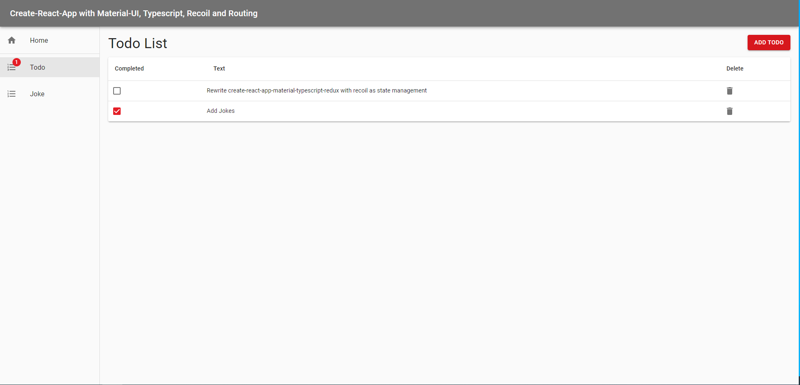

# create-react-app-material-typescript-recoil derived from create-react-app-material-typescript-redux



Inspired by:

-   [create-react-app-material-typescript-redux](https://github.com/innFactory/create-react-app-material-typescript-redux)

## Contains

-   [x] [Material-UI](https://github.com/mui-org/material-ui)
-   [x] [Typescript](https://www.typescriptlang.org/)
-   [x] [React](https://facebook.github.io/react/)
-   [x] [Recoil](https://recoiljs.org/)
-   [x] [Recoil Persist](https://github.com/polemius/recoil-persist)
-   [x] [React Typesafe Routes](https://github.com/innFactory/react-typesafe-routes)
-   [x] [TodoMVC example](http://todomvc.com)

## How to use

```bash
npm install
npm start
```

## Enable Prettier [OPTIONAL]

1.  Step: Install the Prettier plugin (e.g. the one of Esben Petersen)
2.  Add the following snippet to your settings in VSCode:

```json
    "editor.formatOnSave": true,
    "editor.codeActionsOnSave": {
       "source.organizeImports": true // optional
   },
```

## The idea behind the example

This example demonstrate how you can use [Create React App](https://github.com/facebookincubator/create-react-app) with [TypeScript](https://github.com/Microsoft/TypeScript).

## Contributors

-   [Alexander Hauenstein](https://github.com/anderha)
-   [Anton Spöck](https://github.com/spoeck)
